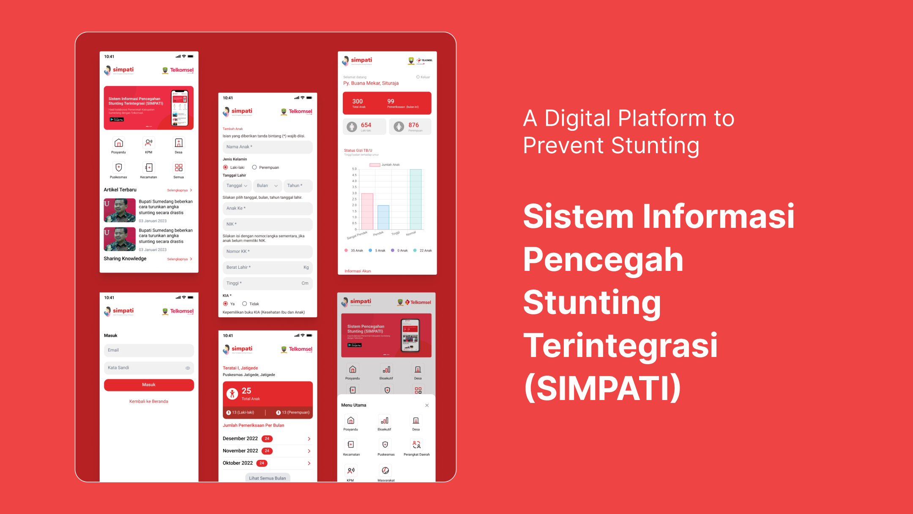

## Using the Netlify CMS locally

I have recently been building a few websites using [Eleventy](https://www.11ty.dev/). This is a *static site generator*, built using [Jamstack](https://jamstack.org/) methodology.

This is a great way to get a simple website built, as it gives you static HTML files which you can serve from anywhere. The downside is there is no database and therefore no traditional content management system to administer the content.

There are tools which help you add a CMS to websites built this way. This is done by using a [headless CMS](https://jamstack.org/headless-cms/) with two options; API-driven and Git-based. I am not using an API to build the content – the content is driven by markdown files, so using a Git-based solution was needed.

1. 

   

[Netlify CMS](https://www.netlifycms.org/) is a drop-in Git-based CMS solution built in React. You create a configuration file and a static HTML file pointing to the JavaScript and you can start editing your content using a nice UI.

## Setup with Eleventy

As I have an Eleventy-based project, I used the tools it provided to add the required files. I added a simple `/src/admin.md` file which generates the `/admin/` HTML.